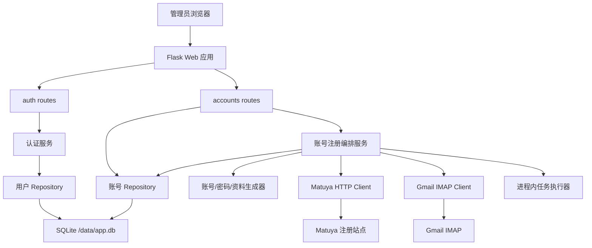
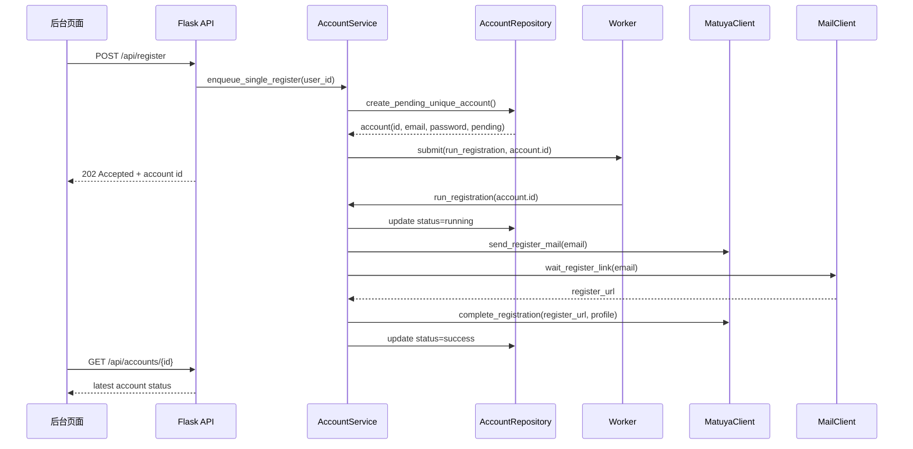
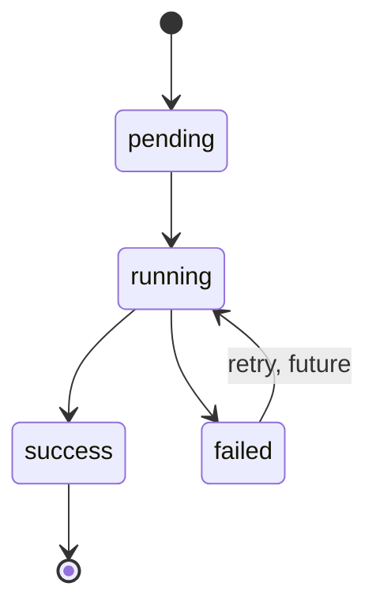

# Matuya 注册工具升级重写概要设计

## 1. 文档目的

本文基于 `requirement/requirements-analysis.md` 和旧版 `matuya-register` 的实现现状，给出升级重写版本的概要设计。目标是为后续详细设计、编码、测试和 Docker 部署提供稳定边界。

新版本不做旧代码的简单平移，而是保留已验证的 Matuya 注册业务链路，重新拆分为轻量化、模块化、可追踪、可持久化的后台应用。

## 2. 设计目标

### 2.1 核心目标

- 提供后台登录能力，未登录用户不可访问注册和历史数据。
- 支持单个和小批量 Matuya 账号注册。
- 生成唯一邮箱账号和随机密码。
- 保存每条注册记录、状态、失败原因、复制次数和时间信息。
- 后台可查询历史记录、筛选状态、复制账号密码。
- 所有可变配置通过环境变量提供，支持 Docker Compose 单容器部署。
- 注册流程、邮件读取、账号生成、数据访问、页面路由互相隔离。

### 2.2 非目标

MVP 阶段暂不实现以下能力：

- 多管理员和复杂权限体系。
- 分布式任务队列。
- Matuya 密码加密存储。
- 注册阶段事件明细后台页面。
- 失败任务一键重试。
- 前端单页应用框架。

## 3. 旧系统现状与升级方向

旧系统已经验证了以下链路：

1. 随机生成邮箱。
2. 请求 Matuya 注册入口并提交邮箱。
3. 使用 Gmail IMAP 查询注册链接。
4. 打开注册链接并提交姓名、电话、密码等表单。
5. 支持 Web 页面单个或批量注册。

旧系统主要限制：

- 管理后台无登录保护。
- 注册账号和密码不持久化。
- 密码固定写死。
- 邮箱唯一性只依赖随机生成，无法应对并发碰撞。
- Gmail、邮箱后缀、Matuya URL 等配置仍在代码模块内。
- Flask 路由直接编排注册、邮件和表单逻辑。
- 批量注册由 HTTP 请求同步等待全部任务完成，用户体验和超时风险较高。
- 失败原因没有结构化落库。

升级方向：

- 保留旧版 `Register`、`Mail`、`Util` 所体现的外部交互行为。
- 使用清晰分层替代路由层堆业务逻辑。
- 使用 SQLite 唯一索引和事务保证邮箱唯一。
- 使用 `secrets` 生成密码和随机邮箱片段。
- 使用后台任务抽象隔离同步/异步执行策略，MVP 可先使用进程内线程池。

旧功能到新模块映射：

| 旧文件 | 旧职责 | 新模块 |
| --- | --- | --- |
| `app.py` | Flask 路由、批量线程池、注册编排 | `auth/routes.py`、`accounts/routes.py`、`accounts/service.py`、`accounts/tasks.py` |
| `register.py` | Matuya 页面请求、隐藏字段解析、表单提交 | `matuya/client.py`、`matuya/parser.py` |
| `mail.py` | Gmail IMAP 查询、邮件正文解析、链接提取 | `mail/imap_client.py`、`mail/parser.py` |
| `util.py` | 邮箱、姓名、电话生成 | `accounts/generator.py` |
| `config.py` | 硬编码 Gmail、邮箱后缀、Matuya URL | `app/config.py` + `.env` |
| `pages.py` | 字符串内嵌 HTML/CSS/JS | `templates/` + `static/` |

## 4. 总体架构

### 4.1 技术选型

| 层次 | 技术 | 说明 |
| --- | --- | --- |
| Web 框架 | Flask 3.x | 延续旧版技术栈，轻量、迁移成本低 |
| 模板 | Jinja2 | 服务端渲染后台页面 |
| 前端脚本 | 原生 JavaScript | 仅处理提交、轮询、复制、局部刷新 |
| 数据库 | SQLite | 单容器部署、低运维成本 |
| 数据访问 | 标准库 `sqlite3` + repository | 保持轻量，避免过早引入 ORM |
| HTTP 客户端 | requests | 对接 Matuya 页面 |
| HTML 解析 | BeautifulSoup4 | 解析隐藏字段 |
| 邮件读取 | imaplib + email | Gmail IMAP 读取注册链接 |
| 任务执行 | ThreadPoolExecutor | MVP 进程内小并发 |
| 密码哈希 | Werkzeug password hash | 管理员密码安全保存 |
| 部署 | Docker + Docker Compose + gunicorn | 单容器运行，SQLite volume 持久化 |

### 4.2 架构图



### 4.3 分层原则

- `routes` 只处理 HTTP 入参、登录校验、响应格式和模板渲染。
- `service` 负责编排业务流程、状态转换和错误归一化。
- `repository` 负责 SQL、事务、唯一约束处理和数据映射。
- `matuya` 只负责目标站点 HTTP 表单交互。
- `mail` 只负责 IMAP 查询和邮件正文 URL 解析。
- `generator` 只负责邮箱、密码、姓名、电话等随机数据生成。

## 5. 目录结构设计

```text
matuya-register/
  app/
    __init__.py
    config.py
    db.py
    logging.py
    auth/
      routes.py
      service.py
      repository.py
      decorators.py
    accounts/
      routes.py
      service.py
      repository.py
      generator.py
      tasks.py
    matuya/
      client.py
      parser.py
      exceptions.py
    mail/
      imap_client.py
      parser.py
      exceptions.py
    templates/
      base.html
      login.html
      accounts.html
      partials/
        account_rows.html
    static/
      app.css
      app.js
  migrations/
    001_init.sql
  tests/
    test_generator.py
    test_repositories.py
    test_mail_parser.py
    test_matuya_parser.py
  wsgi.py
  requirements.txt
  Dockerfile
  docker-compose.yml
  .env.example
  .dockerignore
```

说明：

- `wsgi.py` 作为 gunicorn 入口。
- `app/__init__.py` 创建 Flask app、加载配置、初始化数据库、注册蓝图。
- `migrations/001_init.sql` 保存初始表结构，启动时自动执行幂等迁移。
- `tests/` 优先覆盖纯逻辑和 repository，外部 Matuya/Gmail 交互通过 mock 或 fixture 测试。

## 6. 模块概要设计

### 6.1 配置模块 `app/config.py`

职责：

- 从环境变量读取配置。
- 提供默认值和类型转换。
- 校验关键配置是否缺失。
- 避免在代码库中保存真实密钥。

主要配置：

| 配置项 | 默认值 | 必填 | 说明 |
| --- | --- | --- | --- |
| `APP_SECRET_KEY` | 无 | 是 | Flask Session 密钥 |
| `ADMIN_USERNAME` | 无 | 是 | 初始管理员用户名 |
| `ADMIN_PASSWORD` | 无 | 是 | 初始管理员密码 |
| `SQLITE_PATH` | `/data/app.db` | 否 | SQLite 文件路径 |
| `MATUYA_REGISTER_URL` | 无 | 是 | Matuya 注册入口 |
| `MATUYA_FORM_URL` | 无 | 是 | Matuya 表单提交地址 |
| `MAIL_IMAP_HOST` | `imap.gmail.com` | 否 | IMAP Host |
| `MAIL_IMAP_PORT` | `993` | 否 | IMAP 端口 |
| `MAIL_USERNAME` | 无 | 是 | Gmail 账号 |
| `MAIL_PASSWORD` | 无 | 是 | Gmail app password |
| `MAIL_SUFFIX` | 无 | 是 | 生成邮箱后缀 |
| `REGISTER_MAX_WAIT_SECONDS` | `90` | 否 | 等待邮件最大秒数 |
| `REGISTER_POLL_INTERVAL_SECONDS` | `5` | 否 | 邮件轮询间隔 |
| `HTTP_TIMEOUT_SECONDS` | `20` | 否 | Matuya HTTP 请求超时 |
| `BATCH_MAX_COUNT` | `5` | 否 | 单次批量上限 |
| `BATCH_MAX_WORKERS` | `2` | 否 | 批量并发上限 |

### 6.2 数据库模块 `app/db.py`

职责：

- 管理 SQLite 连接。
- 启用 WAL、外键、合理 busy timeout。
- 提供事务上下文。
- 执行幂等迁移。
- 首次启动时根据环境变量创建或更新初始管理员。

关键策略：

- 每个请求使用独立连接。
- 写操作使用事务。
- SQLite 开启 `PRAGMA journal_mode=WAL`。
- 使用 UTC ISO8601 字符串保存时间。

### 6.3 认证模块 `app/auth`

职责：

- 管理员登录、登出。
- 登录态检查。
- 管理员密码哈希校验。
- 未登录访问后台时跳转 `/login`。

主要接口：

```python
class AuthService:
    def login(username: str, password: str) -> User | None: ...
    def ensure_initial_admin() -> None: ...
```

### 6.4 账号模块 `app/accounts`

职责：

- 创建注册记录。
- 查询历史记录。
- 状态筛选和分页。
- 复制次数原子递增。
- 调度单个或批量注册任务。

主要接口：

```python
class AccountService:
    def enqueue_single_register(created_by: int) -> Account: ...
    def enqueue_batch_register(count: int, created_by: int) -> list[Account]: ...
    def run_registration(account_id: int) -> RegistrationResult: ...
    def list_accounts(status: str | None, page: int, page_size: int) -> Page[Account]: ...
    def record_copy(account_id: int) -> CopyResult: ...
```

### 6.5 生成器模块 `app/accounts/generator.py`

职责：

- 生成邮箱本地部分。
- 生成随机密码。
- 生成姓名、假名、电话。

邮箱唯一性策略：

1. 使用 `Faker` 生成英文名。
2. 拼接日期或年龄片段。
3. 拼接 `secrets.token_hex(3)` 等高熵随机片段。
4. 加上 `MAIL_SUFFIX`。
5. 先插入 `matuya_accounts`，由唯一索引兜底。
6. 如果唯一约束冲突，重新生成并重试，超过次数后失败。

密码策略：

- 使用 `secrets.choice`。
- 默认长度 14 位。
- 默认字符集：大小写字母和数字。
- MVP 不加入符号，降低目标站点表单兼容风险。

### 6.6 Matuya Client `app/matuya`

职责：

- 获取注册入口页面。
- 解析隐藏字段。
- 提交邮箱以发送注册链接邮件。
- 打开邮件注册链接。
- 提交确认表单。
- 提交最终注册表单。

主要接口：

```python
class MatuyaClient:
    def send_register_mail(email: str) -> None: ...
    def complete_registration(register_url: str, profile: RegistrationProfile) -> None: ...
```

错误类型：

- `MatuyaRequestError`
- `MatuyaFormParseError`
- `MatuyaSubmitError`

### 6.7 Mail Client `app/mail`

职责：

- 登录 Gmail IMAP。
- 按收件邮箱搜索最新邮件。
- 提取 text/plain 或 text/html 正文。
- 从正文中解析注册链接。
- 在最大等待时间内轮询。

主要接口：

```python
class MailClient:
    def wait_register_link(recipient: str) -> str: ...
```

错误类型：

- `MailLoginError`
- `MailTimeoutError`
- `MailParseError`

### 6.8 任务执行模块 `app/accounts/tasks.py`

职责：

- 封装 ThreadPoolExecutor。
- 控制最大并发。
- 将注册任务从 HTTP 请求处理中解耦。

MVP 策略：

- 应用启动时创建全局小线程池。
- `POST /api/register` 创建记录后提交后台任务，立即返回记录 ID。
- 页面通过轮询接口刷新状态。
- 单容器部署时可接受任务在进程内执行；容器重启时 `pending` 或 `running` 记录不会自动恢复，页面展示其状态，后续增强再做恢复或重试。

## 7. 数据库概要设计

### 7.1 `users`

```sql
create table if not exists users (
  id integer primary key,
  username text not null unique,
  password_hash text not null,
  created_at text not null,
  updated_at text not null
);
```

### 7.2 `matuya_accounts`

```sql
create table if not exists matuya_accounts (
  id integer primary key,
  email text not null unique,
  password text not null,
  status text not null check (status in ('pending', 'running', 'success', 'failed')),
  error_message text,
  copy_count integer not null default 0,
  last_copied_at text,
  created_by integer,
  started_at text,
  completed_at text,
  created_at text not null,
  updated_at text not null,
  foreign key (created_by) references users(id)
);

create index if not exists idx_matuya_accounts_status
  on matuya_accounts(status);

create index if not exists idx_matuya_accounts_created_at
  on matuya_accounts(created_at);
```

### 7.3 可选表 `registration_events`

MVP 暂不强制创建。若需要更细排错，可在增强阶段加入：

```sql
create table if not exists registration_events (
  id integer primary key,
  account_id integer not null,
  stage text not null,
  message text,
  created_at text not null,
  foreign key (account_id) references matuya_accounts(id)
);
```

## 8. 注册流程设计

### 8.1 单个注册时序



### 8.2 注册状态机



状态含义：

| 状态 | 含义 |
| --- | --- |
| `pending` | 记录已创建，任务尚未开始 |
| `running` | 注册流程执行中 |
| `success` | 注册完成，账号可用 |
| `failed` | 注册失败，查看 `error_message` |

### 8.3 失败处理

注册任务中任一步失败，都必须：

- 捕获异常并归一化为用户可理解的失败原因。
- 更新 `matuya_accounts.status = 'failed'`。
- 写入 `error_message`。
- 写入 `completed_at` 和 `updated_at`。
- 在容器日志中输出详细上下文。

常见失败原因映射：

| 内部异常 | 页面错误文案 |
| --- | --- |
| 配置缺失 | 系统配置缺失，请检查环境变量 |
| IMAP 登录失败 | 邮件服务登录失败 |
| 等待邮件超时 | 未在限定时间内收到注册链接 |
| 邮件解析失败 | 邮件中未找到注册链接 |
| Matuya 请求失败 | 注册站点访问失败 |
| 隐藏字段解析失败 | 注册页面结构可能已变更 |
| 最终提交失败 | 注册提交失败 |
| 邮箱唯一重试耗尽 | 邮箱生成冲突过多，请稍后重试 |

## 9. 页面与接口概要设计

### 9.1 页面

| 方法 | 路径 | 说明 |
| --- | --- | --- |
| `GET` | `/login` | 登录页 |
| `POST` | `/login` | 提交登录 |
| `POST` | `/logout` | 退出登录 |
| `GET` | `/` | 历史列表、状态筛选、发起注册入口 |

后台首页布局：

- 顶部：当前管理员、退出登录。
- 操作区：单个注册按钮、批量数量输入、批量注册按钮。
- 筛选区：全部、注册中、成功、失败。
- 列表区：邮箱、密码、状态、失败原因、复制次数、最近复制时间、创建时间、更新时间。
- 分页区：上一页、下一页、页码。

### 9.2 API

| 方法 | 路径 | 入参 | 返回 | 说明 |
| --- | --- | --- | --- | --- |
| `POST` | `/api/register` | 无 | `{ "account_id": 1, "status": "pending" }` | 发起单个注册 |
| `POST` | `/api/register-batch` | `{ "count": 3 }` | `{ "account_ids": [1,2,3] }` | 发起批量注册 |
| `GET` | `/api/accounts` | `status,page,page_size` | 分页列表 | 查询历史 |
| `GET` | `/api/accounts/<id>` | 无 | 单条记录 | 查询注册状态 |
| `POST` | `/api/accounts/<id>/copy-account` | 无 | 最新复制次数 | 记录账号复制 |

接口约束：

- 所有 API 都需要登录。
- 所有 POST 都需要 CSRF 保护。
- `count` 必须在 `1..BATCH_MAX_COUNT` 范围内。
- `status` 只能是空、`pending`、`running`、`success`、`failed`。
- `page_size` 设置上限，例如 50。

## 10. 批量注册设计

流程：

1. 校验 `count`。
2. 循环创建 `pending` 记录，每条记录独立生成邮箱和密码。
3. 将每条记录提交到线程池。
4. 接口立即返回记录 ID 列表。
5. 前端轮询 `/api/accounts` 或单条状态接口。

并发控制：

- 单次批量数量由 `BATCH_MAX_COUNT` 限制，默认 5。
- 实际执行并发由 `BATCH_MAX_WORKERS` 限制，默认 2。
- 即使多个管理员页面同时发起请求，也共享同一个线程池上限。

一致性：

- 每条账号都是独立记录。
- 单条失败不影响其他账号。
- 失败记录保留邮箱和密码，便于排查。

## 11. 安全设计

- 管理后台默认必须登录。
- 管理员密码只保存哈希。
- Flask `APP_SECRET_KEY` 必须来自环境变量。
- Gmail app password、邮箱后缀、Matuya URL 不写入代码仓库。
- 所有页面加 `<meta name="robots" content="noindex,nofollow">`。
- 所有 POST 操作增加 CSRF token。
- API 返回简短错误，详细堆栈只进入日志。
- SQLite 文件挂载到 `/data/app.db`，由容器和宿主机权限保护。
- Matuya 账号密码因后台需要回显，MVP 保存明文；后续可用环境变量密钥做字段加密。
- 应用提供免责声明，仅用于授权学习、测试或个人场景。

## 12. 可观测性设计

日志使用结构化字段输出，至少包含：

- `account_id`
- `email`
- `stage`
- `status`
- `error`
- `duration_ms`

建议阶段：

- `create_account`
- `send_register_mail`
- `wait_register_link`
- `open_register_link`
- `submit_confirm`
- `submit_final`
- `complete`
- `fail`

页面显示：

- 当前状态。
- 简短失败原因。
- 创建时间、更新时间、完成时间。

容器日志用于定位：

- IMAP 登录失败。
- 等待邮件超时。
- 邮件正文没有 URL。
- Matuya 页面结构变化。
- 表单提交失败。
- 数据库写入异常。

## 13. Docker 部署设计

### 13.1 文件

必须提供：

- `Dockerfile`
- `.dockerignore`
- `docker-compose.yml`
- `.env.example`

### 13.2 Compose 概要

```yaml
services:
  app:
    build: .
    ports:
      - "8926:8926"
    env_file:
      - .env
    volumes:
      - matuya_data:/data
    restart: unless-stopped

volumes:
  matuya_data:
```

### 13.3 运行方式

```bash
docker compose up -d
```

SQLite 默认路径：

```text
/data/app.db
```

## 14. 测试策略

MVP 测试优先覆盖可离线验证的逻辑：

- 邮箱生成格式和碰撞重试。
- 密码长度、字符集和随机性基本约束。
- repository 的唯一索引、状态更新、复制次数原子递增。
- 邮件正文 URL 解析。
- Matuya 隐藏字段解析。
- 登录成功、失败、未登录跳转。
- API 参数校验。

外部交互测试：

- Matuya HTTP 使用 mock HTML fixture。
- Gmail IMAP 使用 fake client 或 mock 返回邮件内容。
- 不在自动测试中真实调用外部站点和 Gmail。

## 15. MVP 实现顺序建议

1. 建立新目录结构、配置模块、Docker 基础文件。
2. 实现 SQLite 初始化、迁移、用户表和初始管理员创建。
3. 实现登录、登出和登录保护。
4. 实现账号表、repository、邮箱和密码生成。
5. 抽离 Matuya Client 和 Mail Client。
6. 实现单个注册任务和状态落库。
7. 实现后台历史列表、筛选、分页。
8. 实现复制账号并记录复制次数。
9. 实现批量注册和线程池并发限制。
10. 补充 `.env.example`、README、测试和部署验证。

## 16. 风险与对策

| 风险 | 影响 | 对策 |
| --- | --- | --- |
| Matuya 页面结构变化 | 隐藏字段解析或提交失败 | 独立 parser，失败落库并记录阶段日志 |
| Gmail IMAP 延迟 | 注册任务耗时或超时 | 最大等待时间、轮询间隔可配置 |
| 进程内任务在容器重启时丢失 | `running` 记录可能停滞 | MVP 接受并展示状态，后续增加恢复或重试 |
| SQLite 写并发有限 | 批量任务写入阻塞 | WAL、busy timeout、小并发限制 |
| 明文保存 Matuya 密码 | 数据库泄漏风险 | 登录保护、文件权限，后续字段加密 |
| 目标站点限制频率 | 注册失败或封禁 | 批量数量、并发数、请求超时和免责声明 |

## 17. 验收映射

| 验收项 | 设计覆盖 |
| --- | --- |
| Docker Compose 可启动 | 第 13 章 |
| 首次启动创建管理员 | 第 6.2、6.3 章 |
| 未登录跳转登录页 | 第 6.3、9 章 |
| 登录后可发起注册 | 第 8、9 章 |
| 历史列表展示账号密码状态 | 第 7、9 章 |
| 复制账号后次数递增并持久化 | 第 6.4、7、9 章 |
| 多次注册不重复邮箱 | 第 6.5、7 章 |
| 批量注册受数量和并发限制 | 第 10 章 |
| Gmail、Matuya、邮箱后缀不硬编码 | 第 6.1 章 |
| SQLite volume 持久化 | 第 13 章 |
| 失败状态和原因落库 | 第 8.3 章 |
