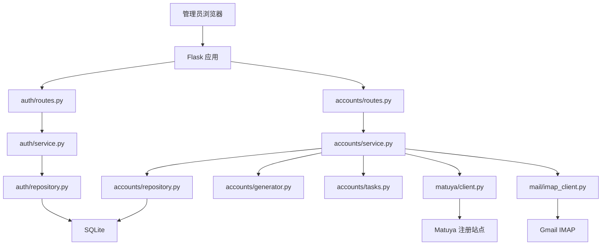

# 架构说明

## 总体架构

`matuya-register` 是一个服务端渲染的 Flask 应用。浏览器通过后台页面或 JSON API 发起注册任务；应用在本进程内使用 `ThreadPoolExecutor` 执行注册；注册状态、账号密码、失败原因和复制次数保存在 SQLite。



## 模块边界

| 模块 | 职责 | 不应承担的职责 |
| --- | --- | --- |
| `app/__init__.py` | 创建 Flask app、加载配置、初始化数据库、注册蓝图 | 连接 Gmail、调用 Matuya、写业务流程 |
| `app/config.py` | 环境变量读取、类型转换、启动校验 | 保存真实密钥、读取外部服务 |
| `app/db.py` | SQLite 连接、迁移、事务、UTC 时间 | 业务查询和状态转换 |
| `app/security.py` | 当前用户加载、CSRF token 生成和校验 | 登录表单处理 |
| `app/i18n.py` | 语言识别、翻译资源加载、JSON 错误文案 | 业务错误归因 |
| `app/auth/*` | 管理员登录、登出、用户表访问 | Matuya 账号逻辑 |
| `app/accounts/routes.py` | 历史页面、注册 API、列表 API、复制 API | SQL、IMAP、HTTP 表单细节 |
| `app/accounts/service.py` | 注册编排、批量校验、错误归一化、状态转换 | HTML 解析、邮件 MIME 解析、模板渲染 |
| `app/accounts/repository.py` | `matuya_accounts` SQL 和数据映射 | 随机数据生成、外部请求 |
| `app/accounts/generator.py` | 邮箱、密码、注册资料生成 | 数据库唯一性最终判断 |
| `app/accounts/tasks.py` | 进程内线程池和任务异常日志 | 持久化任务队列 |
| `app/matuya/*` | Matuya 页面请求、隐藏字段解析、表单提交 | 邮件读取、账号状态落库 |
| `app/mail/*` | Gmail IMAP 登录、搜索、抓取、邮件链接解析 | Matuya 表单提交 |

## 应用启动流程

1. `wsgi.py` 导入 `create_app()`。
2. `load_config()` 从环境变量构造 `AppConfig`。
3. Flask Session 安全配置写入 `app.config`。
4. `db.init_app(app)` 初始化 SQLite，执行 `migrations/*.sql`。
5. `AuthService.ensure_initial_admin()` 根据 `ADMIN_USERNAME` 和 `ADMIN_PASSWORD` 创建或更新管理员。
6. `AccountService.mark_interrupted_running_accounts()` 将上次进程中断遗留的 `running` 记录标为失败。
7. 初始化 i18n、CSRF 和当前用户加载钩子。
8. 注册 `auth` 和 `accounts` 蓝图。

注意：启动阶段不会访问 Gmail 或 Matuya，外部交互只在注册任务中发生。

## 注册任务流程

单条注册由 `AccountService` 编排：

```text
enqueue_single_register()
  -> 生成 email/password
  -> AccountRepository.create_pending()
  -> TaskRunner.submit(run_registration)

run_registration(account_id)
  -> mark_running()
  -> MatuyaClient.send_register_mail(email)
  -> MailClient.wait_register_link(email)
  -> AccountGenerator.generate_profile(password)
  -> MatuyaClient.complete_registration(register_url, profile)
  -> mark_success()
```

任一步异常都会进入失败路径：

```text
Exception
  -> normalize_registration_error()
  -> AccountRepository.mark_failed(account_id, error_key)
  -> 写 registration 日志
```

## 状态机

账号状态保存在 `matuya_accounts.status`，可选值：

| 状态 | 含义 |
| --- | --- |
| `pending` | 记录已创建，任务等待执行 |
| `running` | 注册任务正在执行 |
| `success` | 注册完成 |
| `failed` | 注册失败或任务中断 |

`mark_running()` 当前允许 `pending` 或 `failed` 进入 `running`，这为后续“重试失败记录”保留了空间。当前 UI 尚未实现重试入口。

## 数据模型

初始迁移位于 `matuya-register/migrations/001_init.sql`。

### `users`

后台管理员表。MVP 只支持通过环境变量维护一个初始管理员。

| 字段 | 说明 |
| --- | --- |
| `id` | 主键 |
| `username` | 唯一用户名 |
| `password_hash` | Werkzeug 生成的密码哈希 |
| `created_at` / `updated_at` | UTC ISO8601 时间 |

### `matuya_accounts`

Matuya 注册记录表。

| 字段 | 说明 |
| --- | --- |
| `id` | 主键 |
| `email` | 生成的 Matuya 邮箱账号，唯一 |
| `password` | 生成的 Matuya 密码，明文保存以便后台复制 |
| `status` | `pending`、`running`、`success`、`failed` |
| `error_message` | 稳定错误 key |
| `copy_count` | 邮箱复制次数 |
| `last_copied_at` | 最近复制邮箱时间 |
| `created_by` | 后台管理员用户 ID |
| `started_at` / `completed_at` | 注册任务开始和结束时间 |
| `created_at` / `updated_at` | 记录时间 |

## 外部集成

### Matuya HTTP

`MatuyaClient` 通过 `requests.Session` 完成：

- `GET MATUYA_REGISTER_URL`
- 解析第一个 `<form>` 中的 hidden input
- `POST MATUYA_FORM_URL` 发送邮箱
- `GET` 邮件中的注册链接
- 填写密码、姓名、假名、电话等字段并提交确认
- 再次解析 hidden fields 并提交最终注册

目标站点表单如果变更，通常会表现为 `MatuyaFormParseError` 或 `MatuyaSubmitError`，最终落库为对应错误 key。

### Gmail IMAP

`MailClient` 使用 `imaplib.IMAP4_SSL`：

- 登录 `MAIL_IMAP_HOST:MAIL_IMAP_PORT`
- 选择 `INBOX`
- 按收件人地址搜索 `TO` 或 `CC`
- 读取最近若干封邮件
- 从 text/plain、text/html 或 HTML 原文中提取第一个 URL
- 在 `REGISTER_MAX_WAIT_SECONDS` 内轮询，间隔为 `REGISTER_POLL_INTERVAL_SECONDS`

## 前端交互

后台页面由 Jinja2 首屏渲染，`app/static/app.js` 负责增强交互：

- 单个注册调用 `POST /api/register`。
- 批量注册调用 `POST /api/register-batch`。
- 对 `pending` 和 `running` 记录轮询 `GET /api/accounts/<id>`。
- 同时最多轮询 20 条。
- 复制邮箱后调用 `POST /api/accounts/<id>/copy-account` 增加复制次数。
- 复制密码不增加复制次数。
- 动态文案来自 `window.APP_CONFIG.messages`。

